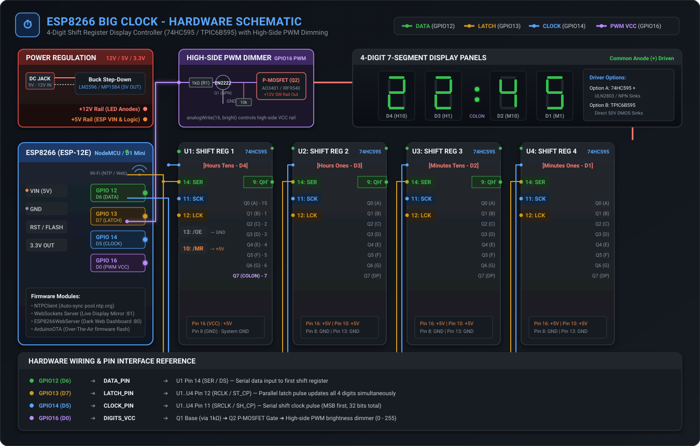

# ⏰ ESP8266 Big Clock

[](https://platformio.org/)
[](https://www.arduino.cc/)
[](https://www.espressif.com/)
[](https://opensource.org/licenses/MIT)

An advanced, WiFi-connected digital wall clock powered by an **ESP8266 (ESP-12E / NodeMCU / WeMos D1 Mini)** driving 4 large 7-segment displays via cascaded **74HC595** or **TPIC6B595** 8-bit shift registers.

Featuring automatic NTP network time synchronization, a dark-mode responsive web dashboard with live WebSocket display mirroring, 24-hour customizable visual hourly effects, day/dusk/night ambient brightness scheduling, and over-the-air (OTA) updates.

---

## 📑 Table of Contents

- [Features](#-features)
- [Hardware Schematic & Wiring](#-hardware-schematic--wiring)
  - [System Schematic Diagram](#system-schematic-diagram)
  - [ESP8266 Pin Connections](#esp8266-pin-connections)
  - [Shift Register Daisy-Chain Architecture](#shift-register-daisy-chain-architecture)
  - [Segment & Colon Bit Mapping](#segment--colon-bit-mapping)
  - [High-Side PWM Brightness Circuit](#high-side-pwm-brightness-circuit)
- [Bill of Materials (BOM)](#-bill-of-materials-bom)
- [Firmware Architecture](#-firmware-architecture)
  - [Timekeeping & NTP Sync](#timekeeping--ntp-sync)
  - [Visual Effects & Hourly Matrix](#visual-effects--hourly-matrix)
  - [Web Dashboard & WebSocket Mirror](#web-dashboard--websocket-mirror)
  - [Fail-Safe AP Mode](#fail-safe-ap-mode)
  - [OTA (Over-The-Air) Updates](#ota-over-the-air-updates)
- [Installation & Flashing](#-installation--flashing)
  - [Prerequisites](#prerequisites)
  - [Building with PlatformIO](#building-with-platformio)
  - [Flashing via USB or OTA](#flashing-via-usb-or-ota)
- [REST API & WebSocket Endpoints](#-rest-api--websocket-endpoints)
- [License](#-license)

---

## ✨ Features

- 🕒 **Precision Network Time Protocol (NTP):** Synchronizes time with `pool.ntp.org` and maintains accurate timekeeping via an internal millisecond-level software RTC between sync intervals.
- 🌐 **Responsive Web Control Center:** Sleek dark-mode dashboard hosted directly on the ESP8266 (port 80) for adjusting time offsets, daylight saving, WiFi credentials, brightness schedules, and hourly animations.
- ⚡ **Real-Time WebSocket Streaming:** Bi-directional WebSocket server (port 81) providing a sub-second live mirror of the physical 7-segment display directly in your browser.
- 🎆 **Configurable Hourly Animation Matrix:** Schedule 6 distinct dynamic visual effects for each individual hour of the day (or let the clock randomly select from enabled effects):
  - **Spin:** Rapid 28-step perimeter trace around all 4 digits.
  - **Cylon:** Back-and-forth Knight Rider / Battlestar Galactica scanner along the middle segments.
  - **Snake:** Slithering multi-segment creature navigating the digit boundaries.
  - **Glitch:** Cyberpunk-style pseudo-random segment flickering.
  - **Flash:** High-visibility strobe alerts.
  - **Slot Machine:** Rolling digit slot-machine transition.
- 🌓 **Day / Dusk / Night Smart Dimming:** 3-tier time-scheduled PWM brightness with customizable transition hours and levels (0–255), plus an optional smooth "Breathing Pulse" sine-wave idle style.
- 📶 **Dual-Network Redundancy:** Store primary and secondary (fallback) WiFi credentials for failover connectivity.
- 🛡️ **Failsafe SoftAP Mode:** Automatically boots into a configuration Access Point (`Clock_Config`) after 5 failed boot/connection attempts, eliminating the need to re-flash the MCU if your WiFi changes.
- 🚀 **ArduinoOTA Integration:** Perform wireless firmware flashes over your local network without physical USB access.

---

## 📐 Hardware Schematic & Wiring

### System Schematic Diagram

The graphic below illustrates the full electrical connection between the ESP8266, the high-side PWM dimming circuit, the 4 cascaded shift registers, and the 7-segment display modules:



> **Vector Graphic:** The high-resolution scalable vector schematic is available in [`assets/schematic.svg`](assets/schematic.svg).

---

### ESP8266 Pin Connections

| ESP8266 GPIO | NodeMCU / D1 Mini Pin | Software Constant | Connects To | Description |
| :--- | :--- | :--- | :--- | :--- |
| **GPIO12** | `D6` | `DATA_PIN` | **U1 Pin 14 (SER / DS)** | Serial Data input to the 1st shift register (Hours Tens) |
| **GPIO13** | `D7` | `LATCH_PIN` | **U1..U4 Pin 12 (RCLK / ST_CP)** | Storage register clock / Latch (parallel to all chips) |
| **GPIO14** | `D5` | `CLOCK_PIN` | **U1..U4 Pin 11 (SRCLK / SH_CP)** | Shift register clock (parallel to all chips) |
| **GPIO16** | `D0` | `DIGITS_VCC` | **Q1 Base Resistor (1kΩ)** | Hardware PWM signal controlling the high-side display power rail |
| **VIN / 5V**| `VIN` / `5V` | — | **5V Buck Converter Output** | 5V DC power for ESP8266 and logic VCC |
| **GND** | `GND` | — | **System Common Ground** | Common ground shared by PSU, ESP8266, and displays |

---

### Shift Register Daisy-Chain Architecture

The display controller shifts out **32 bits (4 bytes)** on every display refresh using standard SPI-style serial data transfer (`MSBFIRST`):

```
                     ┌──────────────────┐
                     │ ESP8266 (ESP-12) │
                     │                  │
                     │   GPIO12 (DATA)  ├─────┐
                     │   GPIO14 (CLOCK) ├──┬──┼──┬─────┬─────┐
                     │   GPIO13 (LATCH) ├──┼──┼──┼──┬──┼──┬──┼──┬──┐
                     └──────────────────┘  │  │  │  │  │  │  │  │  │
                                           │  │  │  │  │  │  │  │  │
             ┌─────────────────────────────┘  │  │  │  │  │  │  │  │
             │                                │  │  │  │  │  │  │  │
             ▼ SER (Pin 14)                   │  │  │  │  │  │  │  │
    ┌─────────────────┐                       │  │  │  │  │  │  │  │
    │  Shift Reg 1    │ SCK (11) ◄────────────┘  │  │  │  │  │  │  │
    │  [Hours Tens]   │ LCK (12) ◄───────────────┘  │  │  │  │  │  │
    │     (D4)        │ QH' (9)  ──────────┐        │  │  │  │  │  │
    └────────┬────────┘                    │        │  │  │  │  │  │
             │ Q0..Q7                      │        │  │  │  │  │  │
             ▼                             ▼ SER    │  │  │  │  │  │
      ┌─────────────┐             ┌─────────────────┤  │  │  │  │  │
      │ Digit 4 (H) │             │  Shift Reg 2    │  │  │  │  │  │
      │  + Colon DP │             │  [Hours Ones]   │◄─┘  │  │  │  │
      └─────────────┘             │     (D3)        │◄────┘  │  │  │
                                  │ QH' (9)  ───────┼─────┐  │  │  │
                                  └────────┬────────┘     │  │  │  │
                                           │ Q0..Q7       │  │  │  │
                                           ▼              ▼ SER │  │
                                    ┌─────────────┐ ┌───────────┴───┤
                                    │ Digit 3 (H) │ │  Shift Reg 3  │
                                    └─────────────┘ │ [Minutes Tens]│◄──┘
                                                    │     (D2)      │◄───┘
                                                    │ QH' (9) ──────┼──┐
                                                    └──────┬────────┘  │
                                                           │ Q0..Q7    │
                                                           ▼           ▼ SER
                                                    ┌─────────────┐ ┌───────────────┐
                                                    │ Digit 2 (M) │ │  Shift Reg 4  │
                                                    └─────────────┘ │ [Minutes Ones]│
                                                                    │     (D1)      │
                                                                    └──────┬────────┘
                                                                           │ Q0..Q7
                                                                           ▼
                                                                    ┌─────────────┐
                                                                    │ Digit 1 (M) │
                                                                    └─────────────┘
```

#### Shift Sequence Logic:
When `updateDisplay(pattern4, pattern3, pattern2, pattern1)` is invoked:
1. `pattern1` (Minutes Ones) is shifted out first.
2. `pattern2` (Minutes Tens) is shifted next, pushing `pattern1` across `QH'` into Register 2.
3. `pattern3` (Hours Ones) is shifted next.
4. `pattern4` (Hours Tens + Colon) is shifted last, remaining in Register 1.
5. Raising `LATCH_PIN` (`GPIO13`) latches all 32 output pins simultaneously, preventing any visible ghosting or flickering.

---

### Segment & Colon Bit Mapping

The firmware assumes standard 7-segment character bit positioning where **Bit 0 is Segment A** and **Bit 7 is the Decimal Point / Colon**:

```
        ─── A (Bit 0, 0x01) ───
       │                       │
 F (Bit 5, 0x20)         B (Bit 1, 0x02)
       │                       │
        ─── G (Bit 6, 0x40) ───
       │                       │
 E (Bit 4, 0x10)         C (Bit 2, 0x04)
       │                       │
        ─── D (Bit 3, 0x08) ───     ● DP / Colon (Bit 7, 0x80)
```

| Segment | Shift Reg Output Pin | Bit Mask | Description |
| :---: | :---: | :---: | :--- |
| **A** | `Q0` (Pin 15) | `0b00000001` (`0x01`) | Top horizontal bar |
| **B** | `Q1` (Pin 1) | `0b00000010` (`0x02`) | Upper-right vertical bar |
| **C** | `Q2` (Pin 2) | `0b00000100` (`0x04`) | Lower-right vertical bar |
| **D** | `Q3` (Pin 3) | `0b00001000` (`0x08`) | Bottom horizontal bar |
| **E** | `Q4` (Pin 4) | `0b00010000` (`0x10`) | Lower-left vertical bar |
| **F** | `Q5` (Pin 5) | `0b00100000` (`0x20`) | Upper-left vertical bar |
| **G** | `Q6` (Pin 6) | `0b01000000` (`0x40`) | Center horizontal bar |
| **DP** | `Q7` (Pin 7) | `0b10000000` (`0x80`) | Decimal point / Center time colon LEDs |

---

### High-Side PWM Brightness Circuit

To smoothly dim high-voltage Common Anode displays (9V–12V), a high-side P-Channel MOSFET switch is driven by an NPN transistor connected to `GPIO16`:

```
               +12V Power In
                     │
                     ├──────────────┬─────────────────────────┐
                     │              │                         │
                   ┌─┴─┐            │ S                       │
             10kΩ  │R2 │          ┌─┴─┐                       │
                   └─┬─┘       G  │   │ P-MOSFET              │
                     ├────────────┤   │ (AO3401 / IRF9540)    │
                     │            └─┬─┘                       │
                   ┌─┴─┐            │ D                       │
            2N2222 │   │ C          │                         │
     GPIO16 ──[1kΩ]┤   │            ▼ Switched DIGITS_VCC     │
    (D0 PWM)  R1   └──┬┘            (To Display Common Anodes)│
                      │ E                                     │
                      ▼                                       ▼
                     GND                                     GND
```

- When `GPIO16` outputs `HIGH`, `Q1` conducts, pulling the gate of `Q2` to `GND` and turning the MOSFET fully **ON**.
- When `GPIO16` outputs `LOW`, `R2` pulls the gate to `+12V`, turning the MOSFET **OFF**.
- Hardware PWM via `analogWrite(DIGITS_VCC, targetBrightness)` (0–255) modulates the effective duty cycle seamlessly.

---

## 📦 Bill of Materials (BOM)

| Component | Quantity | Suggested Part / Value | Notes |
| :--- | :---: | :--- | :--- |
| **Microcontroller** | 1 | ESP8266 (ESP-12E / NodeMCU v2 or WeMos D1) | Core WiFi & logic controller |
| **Shift Registers** | 4 | **TPIC6B595** *(Preferred)* or **74HC595** | 8-bit serial-in shift registers |
| **Low-Side Drivers**| 4 | **ULN2803** *(Only if using 74HC595)* | Sinks segment current on 12V displays |
| **Displays** | 4 | Large 7-Segment Displays (Common Anode) | 2.3", 3", 4", 5", or custom 12V LED strips |
| **Colon LEDs** | 2 | Green / Red / White 5mm or 10mm LEDs | Connected to U1 `Q7` (DP output) |
| **NPN Transistor** | 1 | 2N2222, 2N3904, or BC547 | Level shifter for PWM brightness |
| **P-Channel MOSFET**| 1 | AO3401, IRF9540, or FQP27P06 | High-side power switch for digits rail |
| **Resistors** | 1 | 1 kΩ (1/4W) | Q1 Base resistor |
| | 1 | 10 kΩ (1/4W) | Q2 Gate pull-up resistor |
| | 32 | 100Ω – 470Ω (1/2W) | Segment current-limiting resistors |
| **Capacitors** | 4 | 0.1 µF (100nF) Ceramic | 1 decoupling cap per shift register IC |
| | 1 | 100 µF / 25V Electrolytic | Bulk filtering on 12V input rail |
| **Power Supply** | 1 | 12V DC Adapter (2A – 3A) | Main system power supply |
| **Buck Converter** | 1 | LM2596 or MP1584 Step-Down Module | Steps 12V down to 5.0V for the ESP8266 VIN |

---

## 💻 Firmware Architecture

```
                          ┌──────────────────────────┐
                          │       setup() Boot       │
                          └─────────────┬────────────┘
                                        │
                         Load Preferences & Calibration
                                        │
                     ┌──────────────────┴──────────────────┐
                     │ Boot Fails >= 5?                    │
                    YES                                    NO
                     │                                     │
           ┌─────────▼────────┐                  ┌─────────▼────────┐
           │ SoftAP Mode      │                  │ Connect to WiFi  │
           │ "Clock_Config"   │                  │ (Primary / Sec)  │
           └──────────────────┘                  └─────────┬────────┘
                                                           │
                                                 ┌─────────▼────────┐
                                                 │ Sync NTP Time    │
                                                 │ pool.ntp.org     │
                                                 └─────────┬────────┘
                                                           │
                                                 ┌─────────▼────────┐
                                                 │ Start Web Server │
                                                 │ & WebSockets :81 │
                                                 └─────────┬────────┘
                                                           │
                                                 ┌─────────▼────────┐
                                                 │ Initialize OTA   │
                                                 └─────────┬────────┘
                                                           │
                                        ┌──────────────────▼──────────────────┐
                                        │             loop() Tick             │
                                        ├─────────────────────────────────────┤
                                        │ • webServer.handleClient()          │
                                        │ • webSocket.loop() & broadcastTXT() │
                                        │ • ArduinoOTA.handle()               │
                                        │ • NTP hourly resync                 │
                                        │ • Time RTC increment (hh:mm:ss)     │
                                        │ • Dynamic PWM brightness calculation│
                                        │ • Hourly animation trigger & render │
                                        └─────────────────────────────────────┘
```

### Timekeeping & NTP Sync
- Synchronizes with `pool.ntp.org` on startup and re-syncs every 60 minutes.
- If WiFi drops, timekeeping runs unhindered on the internal millisecond counter (`millis()`).
- Full support for configurable UTC offsets (in seconds) and Daylight Saving Time (+1 hour offset).
- 12-hour or 24-hour mode with automatic leading zero blanking.

### Visual Effects & Hourly Matrix
- Hourly animations can be mapped individually for all 24 hours of the day.
- Checking multiple effects for the same hour triggers **Auto Mode**, randomly selecting an effect when that hour strikes.
- Customizable minute transitions: **Instant Snap** or **Slot Machine Roll**.

### Web Dashboard & WebSocket Mirror
- Modern, mobile-responsive dark interface at `http://<clock-ip>/`.
- Live effects testing bar with direct triggers for Spin, Cylon, Snake, Glitch, Flash, and Slot.
- Live WebSockets client on port `81` continuously pushing the active digit display string (e.g. `12:45`, `SPIN`, `CONF`).

### Fail-Safe AP Mode
If the clock experiences 5 consecutive reboots without completing a successful WiFi handshake, it clears the fail count and starts a standalone Wi-Fi hotspot:
- **SSID:** `Clock_Config`
- **IP Address:** `192.168.4.1`

Connect using any phone or laptop, open the browser, and input your updated router credentials.

### OTA (Over-The-Air) Updates
- ArduinoOTA is pre-configured with hostname `esp8266_CLOCK2` and authentication password `admin`.
- Update firmware over WiFi directly through PlatformIO without plugging into USB.

---

## 🛠️ Installation & Flashing

### Prerequisites
1. Install [VS Code](https://code.visualstudio.com/) and the [PlatformIO IDE Extension](https://platformio.org/).
2. Alternatively, install the PlatformIO Core CLI:
   ```bash
   pip install platformio
   ```

### Project Configuration (`platformio.ini`)
The project utilizes the following PlatformIO environments:

```ini
[env:esp12e]
platform = espressif8266
board = esp12e
framework = arduino
lib_deps = 
    arduino-libraries/NTPClient@^3.2.1
    vshymanskyy/Preferences@^2.1.0
    links2004/WebSockets@^2.4.1

[env:esp12e_ota]
platform = espressif8266
board = esp12e
framework = arduino
upload_protocol = espota
upload_port = esp8266_CLOCK2.local
upload_flags = 
    --auth=admin
lib_deps = 
    arduino-libraries/NTPClient@^3.2.1
    vshymanskyy/Preferences@^2.1.0
    links2004/WebSockets@^2.4.1
```

### Building & Flashing

#### 1. Compile the firmware:
```bash
pio run -e esp12e
```

#### 2. Upload via USB Serial:
Connect your ESP8266 board via USB and run:
```bash
pio run -e esp12e -t upload
```

#### 3. Upload wirelessly via OTA:
Once the clock is connected to your local network:
```bash
pio run -e esp12e_ota -t upload
```

---

## 🌐 REST API & WebSocket Endpoints

| Endpoint | Method | Params / Payload | Description |
| :--- | :---: | :--- | :--- |
| `/` | `GET` | — | Renders the HTML5 Web Dashboard |
| `/trigger` | `GET` | `?fx=<effect_name>` | Immediately triggers a display animation (`spin`, `cylon`, `snake`, `glitch`, `flash`, `slot`) |
| `/save` | `POST` | Form data (`ssid1`, `pass1`, `utc`, `dst`, etc.) | Saves configuration to non-volatile flash and applies changes live |
| `ws://<ip>:81/` | `WS` | — | Real-time WebSocket connection receiving current display text strings |

---

## 📄 License

This project is licensed under the [MIT License](LICENSE) — free for personal, educational, and commercial use.
